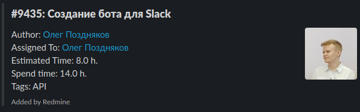
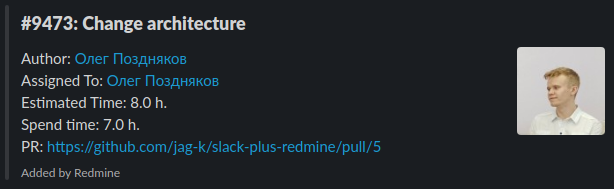
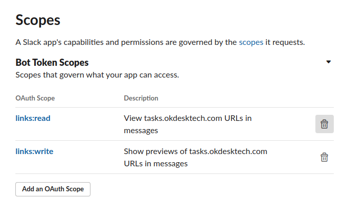
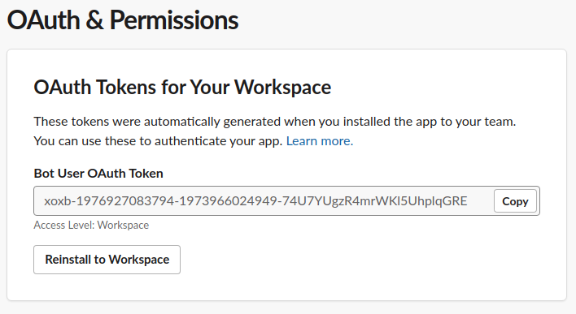
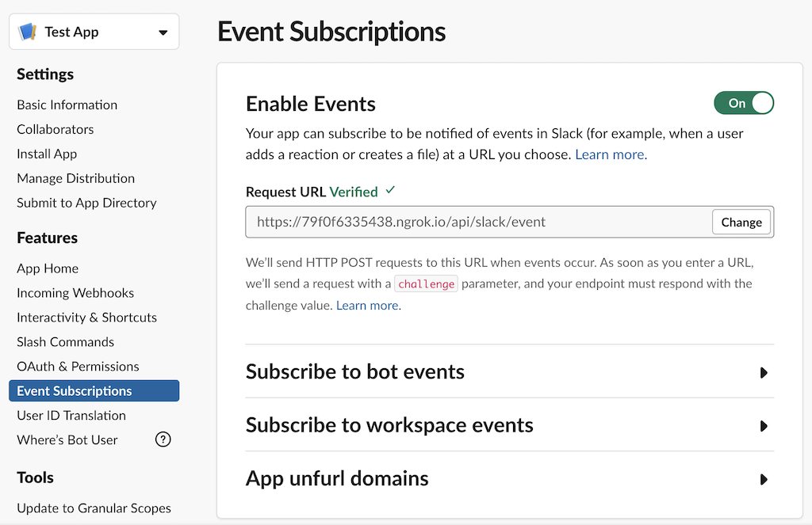
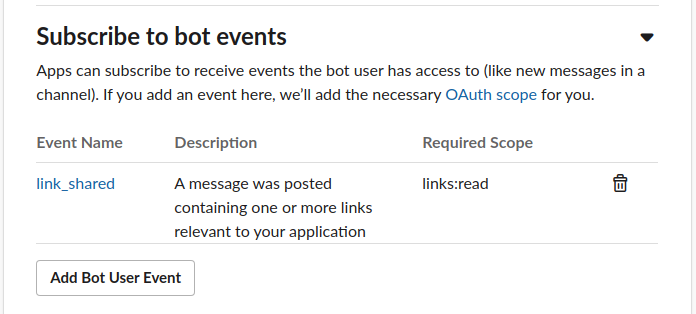
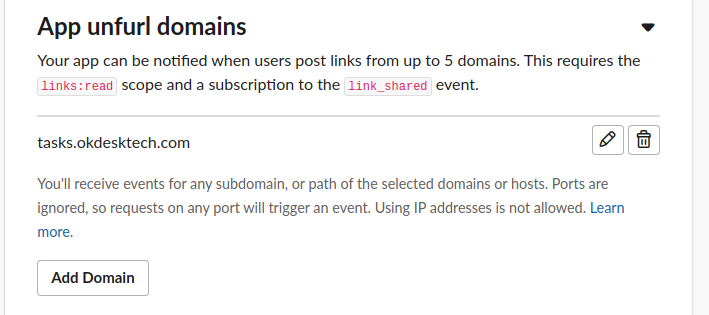

Slack :heart: Redmine
===================================

Look your Redmine Issues in Slack!




## Features

- Add link preview
- Support custom fields
- Add Assigned To avatar

## Running the Sample

### Settings

Create [`.env`](/.env.sample) file with the following settings.

```
SLACK_CLIENT_ID=...
SLACK_CLIENT_SECRET=...
SLACK_SIGNING_SECRET=...
SLACK_VERIFICATION_TOKEN=...
SLACK_TOKEN=xoxb-...

REDMINE_DOMAIN=https://demo.redmine.com
REDMINE_TOKEN=...
```

Get the values from [your app's](https://api.slack.com/apps) _Basic Information_ settings.

Run `bundle install` and `foreman start`.

### Install App

#### Local development

Register your app via OAuth workflow from [localhost:5000](http://localhost:5000).

Expose the local server port `5000` to receive Slack events using [ngrok](https://ngrok.com).

```bash
ngrok http 5000
```

Copy the URL, e.g. `https://79f0f6335438.ngrok.io`, and use it as the prefix for your events, slash commands, and interactive message buttons.

#### Server installation

Add `RACK_ENV=production` in [`.env`](/.env) file

### OAuth Scopes

See [config/initializers/slack_ruby_bot_server.rb](config/initializers/slack_ruby_bot_server.rb) for the required OAuth scopes. If you get `Slack::Web::Api::Errors::MissingScope: missing_scope` errors, you are missing a scope in your app configuration.



Install bot to workspace and copy `Bot User OAuth Token` to `.env` (`SLACK_TOKEN`)



### Events

Set the _Request Url_ in your app's Features under _Event Subscriptions_, e.g. `https://79f0f6335438.ngrok.io/api/slack/event`. When you change this URL, Slack will `POST` a verification challenge to `/api/slack/event`, which should succeed.



Subscribe to `link_shared` events.



Add Your Redmine domain in _App unfurl domains_ 

